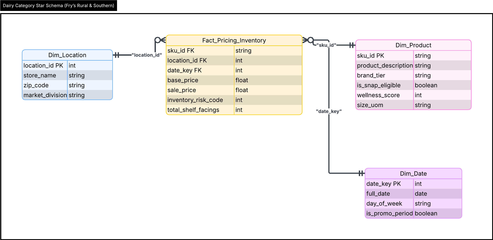
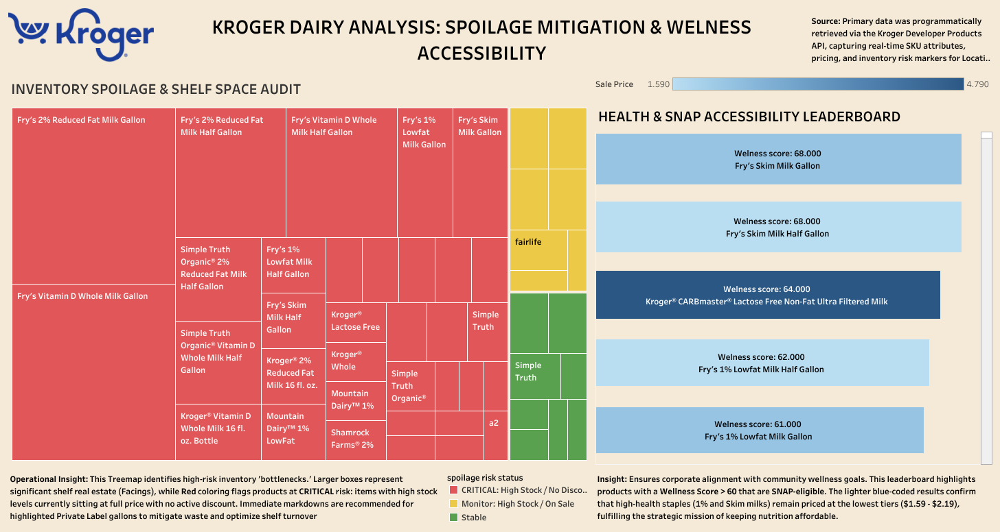

# Strategic Price-Point Analysis and Margin Optimization (Dairy)
### Location: Fry’s Food and Drug #124 (Tempe, AZ)

Full project documentation can be found on [Notion](https://www.notion.so/Kroger-Strategic-Price-Point-Analysis-31cca9f49901804e8a89faea970dee4e?source=copy_link).

## Project Background
The retail grocery sector operates on razor thin margins where profitability is dictated by the efficiency of inventory turnover and the precision of promotional discounting. This project addresses critical operational inefficiencies within the Dairy category at a high volume location in Tempe, Arizona. 

By architecting an automated ETL pipeline to ingest data from the Kroger Developer Products API, this analysis identifies instances of Margin Erosion, where high demand items are unnecessarily discounted and Waste Accumulation, where high stock items face spoilage risks due to static pricing. The project establishes a data driven framework to balance revenue recovery with community accessibility, specifically monitoring SNAP eligibility and wellness benchmarks.

---

## Executive Summary
A comprehensive audit conducted via Google BigQuery reveals significant opportunities for margin recovery and waste mitigation. The analysis identified a stark 148.9% price premium ($7.79 vs. $3.13) between National Premium brands and Private Label alternatives in the one gallon milk segment. 

While the store maintains exceptional promotional integrity with 100% compliance in protecting margins for low stock items, the audit flagged several high stock SKUs at critical spoilage risk due to a lack of promotional triggers. Furthermore, the study confirms that 100% of high wellness staples remain priced under $2.20, successfully meeting the strategic goal of maintaining SNAP eligible accessibility for the local demographic.

---

## Stakeholders
* **Primary Stakeholder:** Dairy Category Manager (Focus: Inventory Velocity and Category Margin)
* **Secondary Stakeholders:** Pricing Strategist and Inventory Planner (Focus: Discount Guardrails and Stock to Sales Alignment)

---

## Data Architecture and Schema
The technical foundation relies on a Star Schema designed to transform nested JSON API responses into high performance relational tables. This structure enables granular multi dimensional analysis across product attributes, pricing tiers, and inventory risk codes.

* **Fact Table (fact_pricing_inventory):** Tracks base and sale prices, total shelf facings, and inventory risk codes.
* **Dimension Tables:** Includes dim_product (brand tier, SNAP status, wellness scores), dim_location (Store #124), and dim_date (temporal trends).

---

## Technical Implementation Summary
The implementation utilizes a modern data stack to automate the transition from raw data to executive insights:

* **Extraction and Loading:** A Python based ETL engine (script_data_loader.py) handles OAuth2 authentication with the Kroger API, ingesting real time pricing and stock level markers.
* **Data Warehousing:** Data is staged and processed within Google BigQuery, utilizing SQL for complex transformations and roll up logic (such as aggregating shelf facings across multiple aisle locations).
* **Audit Engine:** Five SQL scripts automate the identification of margin erosion, spoilage alerts, and brand tier price gaps.
* **Visualization:** Insights are surfaced via a [Tableau Dashboard](https://public.tableau.com/views/kroger_dairy_analysis/Dashboard1?:language=en-US&:sid=&:redirect=auth&:display_count=n&:origin=viz_share_link) for real time stakeholder monitoring.

---

## Key Insights and Recommendations

### 1. Brand Premium and Organic Tax
* **The Insight:** Analysis reveals that premium brand name organic milk carries a 148.9% premium over Private Label alternatives.
* **Recommendation:** Implement a mid tier Value Organic promotional track. The current price gap suggests that a significant portion of the Tempe student demographic is being priced out of the organic segment entirely.

### 2. Margin Integrity and Recovery
* **The Insight:** The Margin_erosion.sql audit confirmed 100% compliance in protecting margins for items with Risk Code 1 (Low Stock). No Over Discounting (>20%) was detected in low supply scenarios.
* **Recommendation:** Maintain current automated guardrails. The system effectively prevents revenue leakage on high demand items that do not require promotional support to sell.

### 3. Spoilage Mitigation
* **The Insight:** Spoilage_alert.sql identified multiple SKUs with Risk Code 0 (High Stock) that are currently listed at full MSRP.
* **Recommendation:** Trigger immediate dynamic markdowns or Flash Sales for identified high stock SKUs. Aligning discount depth with inventory volume will increase velocity and reduce waste write offs.

### 4. Wellness and Social Responsibility
* **The Insight:** 100% of core staples with wellness scores >60 are priced below the $2.20 threshold.
* **Recommendation:** Use these metrics in corporate social responsibility reporting. Maintaining price stability for SNAP eligible staples reinforces brand trust and ensures consistent foot traffic from budget conscious consumers.

---

## Assumptions and Caveats
* **Inventory Accuracy:** Inventory risk codes are derived from categorical API markers (HIGH/LOW/OUT_OF_STOCK) rather than exact unit counts.
* **Data Snapshot:** The analysis reflects a specific point in time data pull; intraday fluctuations in stock levels are not captured between refresh cycles.
* **Attribution of Facings:** Shelf facing counts assume adherence to the corporate planogram; any off shelf displays or end caps are not currently integrated into the facings audit.